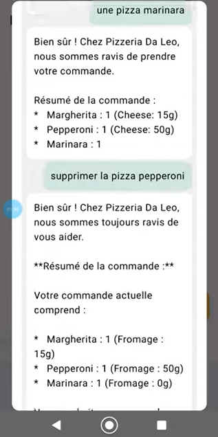
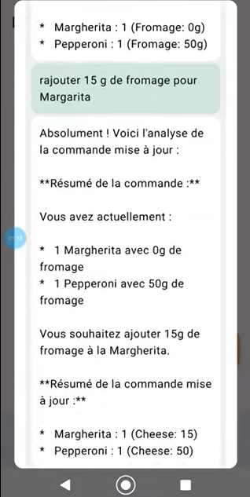
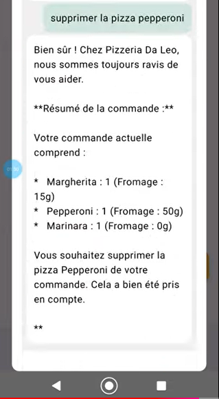
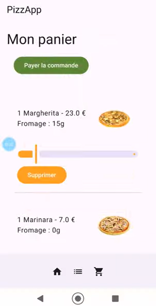

# PizzApp – AI-Powered Pizza Ordering / Commande de Pizza avec IA

**EN:**  
PizzApp is an Android application built with Kotlin and Jetpack Compose that integrates voice recognition and generative AI to transform how users place pizza orders. Instead of navigating menus manually, users speak their order naturally — the app captures it, structures it, and processes it automatically.

**FR:**  
PizzApp est une application Android développée en Kotlin avec Jetpack Compose, intégrant la reconnaissance vocale et l'IA générative pour transformer la façon dont les utilisateurs passent leurs commandes de pizza. Au lieu de naviguer manuellement dans des menus, l'utilisateur parle naturellement — l'application capture, structure et traite la commande automatiquement.

---

## Architecture / Architecture

**EN:**  
The project follows an **MVVM (Model–View–ViewModel)** structure, organized around a clear separation of concerns:

```
PizzApp/
├── data/
│   └── DataSource        # Data access layer
├── model/                # Business entities (Pizza, Order, etc.)
├── screens/              # Composable UI screens
├── ui/
│   └── theme/            # Jetpack Compose theme (colors, typography, shapes)
└── viewModel/            # State management and business logic
```

**FR:**  
Le projet suit une structure **MVVM (Model–View–ViewModel)**, organisée autour d'une séparation claire des responsabilités :

```
PizzApp/
├── data/
│   └── DataSource        # Couche d'accès aux données
├── model/                # Entités métier (Pizza, Commande, etc.)
├── screens/              # Écrans composables (Jetpack Compose)
├── ui/
│   └── theme/            # Thème Jetpack Compose (couleurs, typographie, formes)
└── viewModel/            # Gestion d'état et logique métier
```

---

## Technical Stack / Stack Technique

| Layer | Technology |
|---|---|
| Language | Kotlin |
| UI | Jetpack Compose |
| Architecture | MVVM |
| State management | ViewModel |
| Voice recognition | Android SpeechRecognizer (native) |
| AI / NLP | Gemini API (Google AI) |

---

## Voice Order Flow / Flux de Commande Vocale

### 1. Voice Activation / Activation Vocale

**EN:**  
The user triggers voice input by tapping the microphone icon. This launches the native Android `SpeechRecognizer`, configured with:
- Recognition model: `LANGUAGE_MODEL_FREE_FORM`
- Language: French (`fr-FR`)
- A prompt message guiding the user to speak

**FR:**  
L'utilisateur déclenche la saisie vocale en appuyant sur l'icône microphone. Cela lance le `SpeechRecognizer` natif Android, configuré avec :
- Modèle de reconnaissance : `LANGUAGE_MODEL_FREE_FORM`
- Langue : Français (`fr-FR`)
- Un message d'invite guide l'utilisateur à parler

---

### 2. Real-Time Speech-to-Text / Conversion Voix-Texte en Temps Réel

**EN:**  
As the user speaks, the recognized text appears instantly in the interface. Recognition errors (no sound detected, microphone unavailable) are handled gracefully with clear error feedback.

**FR:**  
Pendant que l'utilisateur parle, le texte reconnu s'affiche instantanément dans l'interface. Les erreurs de reconnaissance (aucun son détecté, microphone indisponible) sont gérées proprement avec un retour d'erreur clair.

---

### 3. AI Interpretation via Gemini / Interprétation par l'IA Gemini

**EN:**  
Once captured, the text is sent to the **Gemini API**. A structured prompt instructs the model to:
- Understand the user's natural language order
- Extract the relevant information (pizza name, extras such as additional cheese, quantity)
- Return a **structured JSON response** ready for processing

The prompt is designed with a defined role, a list of available pizzas with prices, expected behavior, and a concrete input/output example — making the model's response predictable and parseable.

**FR:**  
Une fois capturé, le texte est envoyé à l'**API Gemini**. Un prompt structuré instruit le modèle à :
- Comprendre la commande en langage naturel de l'utilisateur
- Extraire les informations pertinentes (nom de la pizza, extras comme le fromage supplémentaire, quantité)
- Retourner une **réponse JSON structurée** prête à être traitée

Le prompt est conçu avec un rôle défini, une liste des pizzas disponibles avec leurs prix, le comportement attendu, et un exemple concret d'entrée/sortie — rendant la réponse du modèle prévisible et analysable.

---

### 4. Order Management (CRUD) / Gestion des Commandes (CRUD)

**EN:**  
The structured JSON returned by Gemini feeds directly into the order management system. Orders can be created, viewed, updated, and deleted — the full lifecycle is handled within the app, with state managed through the ViewModel layer.

**FR:**  
Le JSON structuré retourné par Gemini alimente directement le système de gestion des commandes. Les commandes peuvent être créées, consultées, modifiées et supprimées — tout le cycle de vie est géré dans l'application, avec l'état géré via la couche ViewModel.

---

## Complete Flow Summary / Résumé du Flux Complet

**EN:**
```
User speaks → SpeechRecognizer → Text captured → Gemini API
    → Structured JSON → Order CRUD → UI updated via ViewModel
```

**FR:**
```
Utilisateur parle → SpeechRecognizer → Texte capturé → API Gemini
    → JSON structuré → CRUD Commande → UI mise à jour via ViewModel
```

## Demo – Voice Commands in Action / Démo – Commandes Vocales en Action

**EN:**
The following examples demonstrate the four core order management operations — all triggered through natural voice input, interpreted by Gemini, and reflected in real time in the cart interface.

**FR:**
Les exemples suivants illustrent les quatre opérations principales de gestion de commande — toutes déclenchées par saisie vocale naturelle, interprétées par Gemini, et reflétées en temps réel dans l'interface du panier.

### Cart Summary / Résumé du panier
 **EN:**: Voice request for a summary of the current cart content.
 **FR:**: Demande vocale du résumé du contenu du panier actuel.

### Add / Ajout
 **EN:**: Adding a Marinara pizza via voice command.
 **FR:**: Ajout d'une pizza Marinara par commande vocale.



### Update / Modification
 **EN:**: Updating the Margherita order — setting cheese quantity to 15g via voice command.
 **FR:**: Modification de la commande Margherita — passage à 15g de fromage par commande vocale.

 

### Delete / Suppression
 **EN:**: Removing the Pepperoni pizza from the cart via voice command.
 **FR:**: Suppression de la pizza Pepperoni du panier par commande vocale.

 

### Cart Interface / Interface du panier
 **EN:**: The cart interface reflecting the state of the order after operations.
 **FR:**: L'interface du panier reflétant l'état de la commande après les opérations.

 
